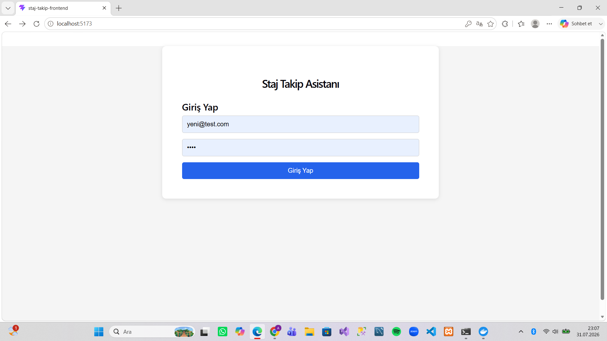
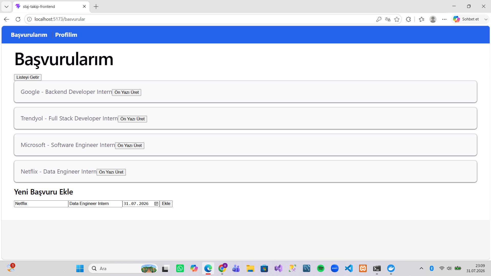
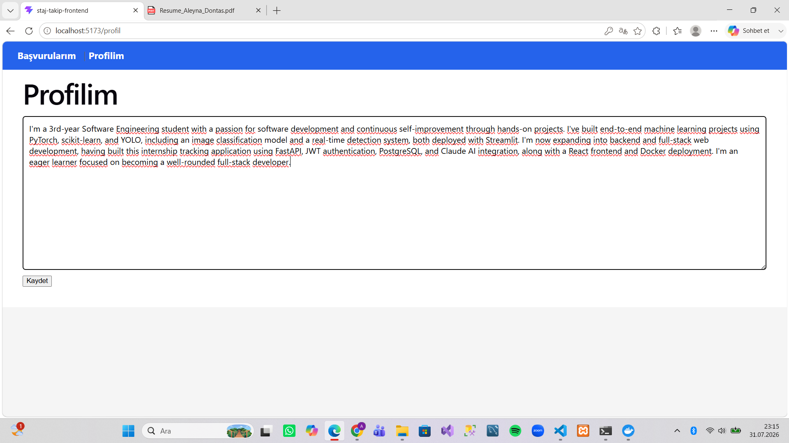
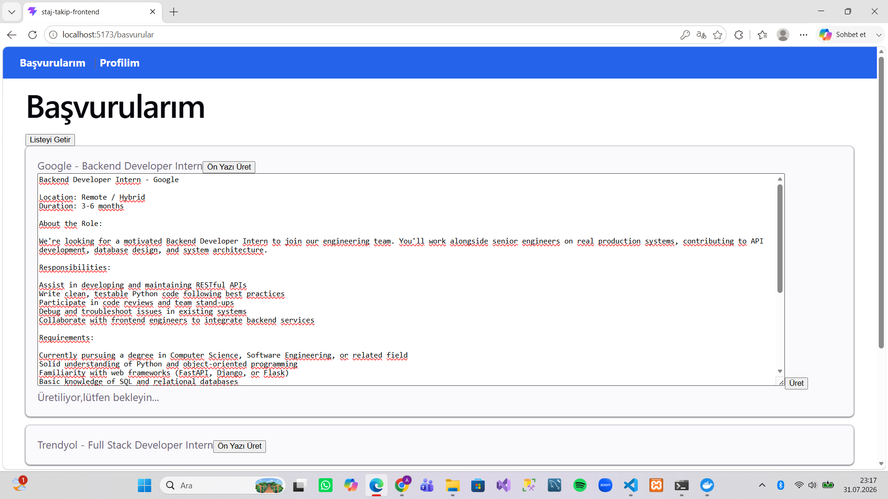
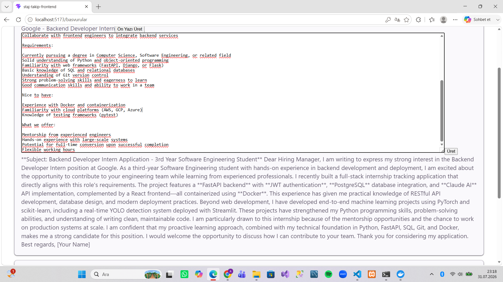

# Staj Takip Asistanı

Staj başvurularını takip etmek, yönetmek ve yapay zeka desteğiyle, ilana özel ön yazı üretmek için geliştirilmiş, tam kapsamlı bir web uygulaması.

## Özellikler

- Kullanıcı kayıt/giriş sistemi (JWT tabanlı kimlik doğrulama)
- Staj başvurularını ekleme, listeleme, güncelleme, silme (CRUD)
- Claude AI entegrasyonu ile, ilana özel ön yazı üretimi
- Kullanıcı profili (CV bilgisi) yönetimi
- React tabanlı, modern kullanıcı arayüzü
- Docker ve PostgreSQL ile, production-ready altyapı

## Kullanılan Teknolojiler

**Backend:** Python, FastAPI, SQLAlchemy, PostgreSQL, JWT, Anthropic Claude API
**Frontend:** React, React Router
**DevOps:** Docker, Docker Compose

## Kurulum

```bash
docker compose up
```

Backend, `http://localhost:8000` adresinde çalışır.
## Ekran Görüntüleri

### Giriş Sayfası


### Başvurular Sayfası


### Profilim Sayfası


### İlan Metni Girme


### Üretilen Ön Yazı

